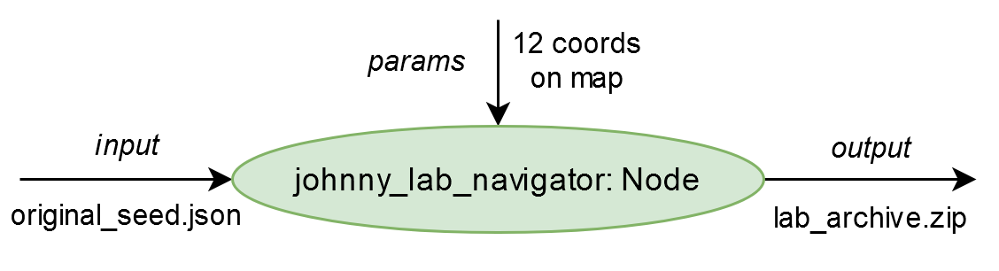
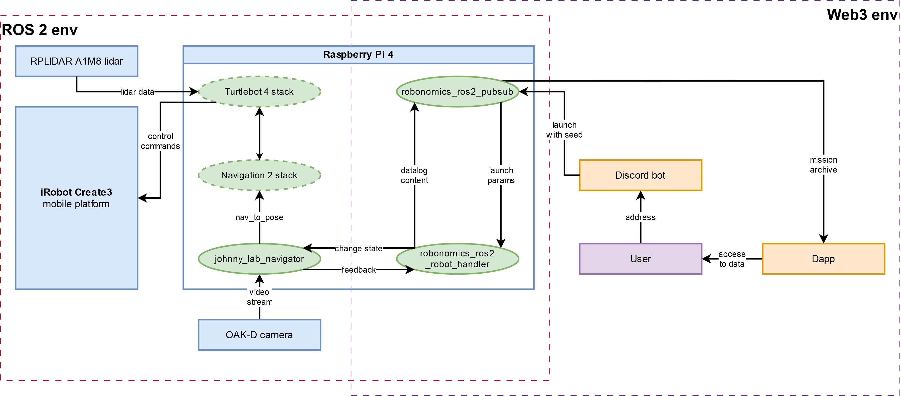

<a name="readme-top"></a>

<!-- PROJECT SHIELDS -->
[![Contributors][contributors-shield]][contributors-url]
[![Forks][forks-shield]][forks-url]
[![Stargazers][stars-shield]][stars-url]
[![Issues][issues-shield]][issues-url]
[![Apache-2.0 License][license-shield]][license-url]


<!-- PROJECT TITLE -->
<br />
<div align="center">
<h3 align="center">Hack Johnny Lab</h3>

<p align="center">
ROS 2 package for the Hack Johnny's Lab quest: TurtleBot 4 navigation mission, OAK-D video recording, and Robonomics/IPFS result publishing
</p>
</div>

<!-- TABLE OF CONTENTS -->
<details>
  <summary>Table of Contents</summary>
  <ol>
    <li>
      <a href="#about-project">About Project</a>
      <ul>
        <li><a href="#project-structure">Project Structure</a></li>
        <li><a href="#project-architecture">Project Architecture</a></li>
      </ul>
    </li>
    <li>
      <a href="#getting-started">Getting Started</a>
      <ul>
        <li><a href="#prerequisites">Prerequisites</a></li>
        <li><a href="#installation-and-building">Installation and Building</a></li>
        <li><a href="#configuration">Configuration</a></li>
      </ul>
    </li>
    <li><a href="#usage">Usage</a></li>
    <li><a href="#license">License</a></li>
    <li><a href="#media-about-project">Media About Project</a></li>
    <li><a href="#contact">Contact</a></li>
    <li><a href="#acknowledgments">Acknowledgments</a></li>
  </ol>
</details>

<!-- ABOUT THE PROJECT -->
## About Project

Hack Johnny Lab is a ROS 2 Python package that implements the main robot logic used in the **Hack Johnny's Lab** quest by Robonomics.

[](http://www.youtube.com/watch?v=mDRYbI7iXsI "Multi-Agent System in Hack Johnny's Lab Quest")

The goal of the project is to execute a full autonomous TurtleBot 4 mission in the lab, generate game artifacts, and publish results through Robonomics:

* receive a launch task containing seed data
* run navigation through predefined waypoints (with random word-to-point mapping)
* record video from OAK-D camera
* save mission data (`data.json`) and package all artifacts into an archive
* publish archive info via Robonomics datalog pipeline

<p align="right">(<a href="#readme-top">back to top</a>)</p>

### Project Structure

    .
    ├── config
    │   ├── turtlebot4_localization.yaml     # AMCL + map server localization parameters
    │   └── turtlebot4_nav2.yaml             # Nav2 stack parameters (planner/controller/costmaps/etc.)
    ├── launch
    │   ├── johnny_lab_launch.py             # Starts Robonomics pubsub + robot handler + lifecycle navigator
    │   └── localization_and_nav.launch.py   # Includes TurtleBot4 localization and Nav2 launch files
    ├── turtlebot4_johnny_lab
    │   ├── johnny_lab_navigator.py          # Lifecycle node: mission execution, navigation, video, archive
    │   ├── johnny_lab_robonomics.py         # Robonomics handler: launch processing + datalog sending
    │   └── ...
    └── ...

<p align="right">(<a href="#readme-top">back to top</a>)</p>

### Project Architecture

The system is organized as three connected layers, where ROS 2 runtime and Web3 services cooperate in one mission pipeline.

1. **Robot mission layer (ROS 2 / TurtleBot 4 stack)**
   `johnny_lab_navigator` is a lifecycle node with states `configure -> activate -> deactivate -> cleanup`.
   In these states it:
   * loads mission inputs (seed file path, waypoint configuration)
   * undocks and initializes localization (initial pose + calibration rotations)
   * navigates through route points (`NavigateToPose`)
   * records mission video from OAK-D (`depthai` + `av`)
   * returns to dock, packs artifacts, and publishes archive file name to ROS topic `johnny_lab_navigator/archive_name`



2. **Bridge layer (ROS 2 + Web3 / Robonomics wrapper)**
   `robonomics_ros2_pubsub` provides launch/datalog and IPFS access for ROS nodes.
   `johnny_lab_robonomics` (robot handler) receives launch payloads, prepares mission file for navigator, drives lifecycle transitions via `/johnny_lab_navigator/change_state`, and sends final archive reference as Robonomics datalog.

3. **Application layer (Web3 agents)**
   External agents (Discord bot, dApp, users) create mission demand, read published outputs, and use resulting data in the game flow.

Mission output artifacts:

* Archive file name format: `johnny_lab_archive_<DD-MM-YYYY-HH-MM-SS>.zip`
* Archive location: in `ipfs_dir_path` configured and used by Robonomics pubsub
* Archive contents:
  * `data.json` with:
    * `points`: coordinates associated with mission stops
    * `words`: shuffled seed words collected during the run
  * `johnny_lab_record.mp4`: mission video recorded from OAK-D

Full system scheme:



In the Hack Johnny's Lab game, this architecture allowed the bot to trigger a real robot run, the robot to autonomously produce evidence (video + shuffled seed words), and Robonomics to deliver verifiable mission results back to players through Web3 infrastructure.


<p align="right">(<a href="#readme-top">back to top</a>)</p>

## Getting Started

### Prerequisites

Make sure the following base components are installed and available:

* Linux OS distribution (tested on [Ubuntu 22.04.4](https://releases.ubuntu.com/jammy/))
* ROS 2 distribution (tested on [Humble](https://docs.ros.org/en/humble/Installation.html))
* [Python 3](https://www.python.org/downloads/) (tested on 3.10.12)
* [TurtleBot 4](https://turtlebot.github.io/turtlebot4-user-manual/) software stack (including `turtlebot4_navigation`)
* [Robonomics ROS 2 Wrapper](https://github.com/airalab/robonomics-ros2) packages
* `depthai` and `av` Python packages (used by OAK-D video pipeline)

<p align="right">(<a href="#readme-top">back to top</a>)</p>

### Installation and Building

1. Complete the baseline TurtleBot 4 setup:
   https://turtlebot.github.io/turtlebot4-user-manual/setup/basic.html

2. Create a ROS 2 workspace:

    ```shell
    mkdir -p ~/johnny_lab_ws/src
    cd ~/johnny_lab_ws/src
    ```

3. Clone this repository:

    ```shell
    git clone https://github.com/Fingerling42/hack-johnny-lab.git
    ```

4. Build from workspace root:

    ```shell
    cd ~/johnny_lab_ws
    colcon build
    ```

5. Source workspace:

    ```shell
    source install/setup.bash
    ```

<p align="right">(<a href="#readme-top">back to top</a>)</p>

### Configuration

Prepare these inputs before running the mission:

1. **Map file** for localization launch (e.g. `johnny_lab_map.yaml`).
2. **Navigator parameters YAML** with initial pose and waypoint set (`navigator_params_path`).
3. **Robonomics pubsub parameters YAML** (`pubsub_params_path`) with account/IPFS/subscription settings.

Expected navigator parameter structure:

```yaml
init:
  position: [x, y]
  rotation: 0.0
points:
  1:
    position: [x, y]
    rotation: 0.0
  2:
    position: [x, y]
    rotation: 0.0
  ...
```

Notes:

* number of route points should match seed phrase words used in the mission logic
* `johnny_lab_launch.py` supports a `namespace` launch argument

<p align="right">(<a href="#readme-top">back to top</a>)</p>

## Usage

Typical flow used in the project:

1. Build a map (SLAM):

```shell
ros2 launch turtlebot4_navigation slam.launch.py params:=./turtlebot4_slam.yaml
```

2. Save map:

```shell
ros2 service call /slam_toolbox/save_map slam_toolbox/srv/SaveMap "name:
  data: 'johnny_lab_map'"
```

3. Start localization and Nav2 with the map:

```shell
ros2 launch turtlebot4_johnny_lab localization_and_nav.launch.py map:=./johnny_lab_maps/johnny_lab_map.yaml
```

4. Start mission stack:

```shell
ros2 launch turtlebot4_johnny_lab johnny_lab_launch.py \
  pubsub_params_path:=./robonomics_pubsub_params.yaml \
  namespace:='johnny_lab_navigator' \
  navigator_params_path:=./johnny_lab_params.yaml
```

<p align="right">(<a href="#readme-top">back to top</a>)</p>

## License

Distributed under the Apache-2.0 License. See `LICENSE` for more information.

<p align="right">(<a href="#readme-top">back to top</a>)</p>

<!-- MEDIA -->
## Media About Project

* Quest rules and context: [Blog post](https://robonomics.network/blog/robonomics-school-2024-hack-johnny-lab/)
* Post-game analysis: [Blog post](https://robonomics.network/blog/hacked-johnnys-lab/)

<p align="right">(<a href="#readme-top">back to top</a>)</p>

<!-- CONTACT -->
## Contact

Ivan Berman - [@berman_ivan](https://twitter.com/berman_ivan) - fingerling42@proton.me

<p align="right">(<a href="#readme-top">back to top</a>)</p>

<!-- ACKNOWLEDGMENTS -->
## Acknowledgments

* [Best-README-Template](https://github.com/othneildrew/Best-README-Template/)
* [TurtleBot 4 Documentation](https://turtlebot.github.io/turtlebot4-user-manual/)
* [Robonomics ROS 2 Wrapper](https://github.com/airalab/robonomics-ros2)

<p align="right">(<a href="#readme-top">back to top</a>)</p>

<!-- MARKDOWN LINKS & IMAGES -->
<!-- https://www.markdownguide.org/basic-syntax/#reference-style-links -->
[contributors-shield]: https://img.shields.io/github/contributors/Fingerling42/hack-johnny-lab.svg?style=for-the-badge
[contributors-url]: https://github.com/Fingerling42/hack-johnny-lab/graphs/contributors
[forks-shield]: https://img.shields.io/github/forks/Fingerling42/hack-johnny-lab.svg?style=for-the-badge
[forks-url]: https://github.com/Fingerling42/hack-johnny-lab/network/members
[stars-shield]: https://img.shields.io/github/stars/Fingerling42/hack-johnny-lab.svg?style=for-the-badge
[stars-url]: https://github.com/Fingerling42/hack-johnny-lab/stargazers
[issues-shield]: https://img.shields.io/github/issues/Fingerling42/hack-johnny-lab.svg?style=for-the-badge
[issues-url]: https://github.com/Fingerling42/hack-johnny-lab/issues
[license-shield]: https://img.shields.io/github/license/Fingerling42/hack-johnny-lab.svg?style=for-the-badge
[license-url]: https://github.com/Fingerling42/hack-johnny-lab/blob/main/LICENSE
